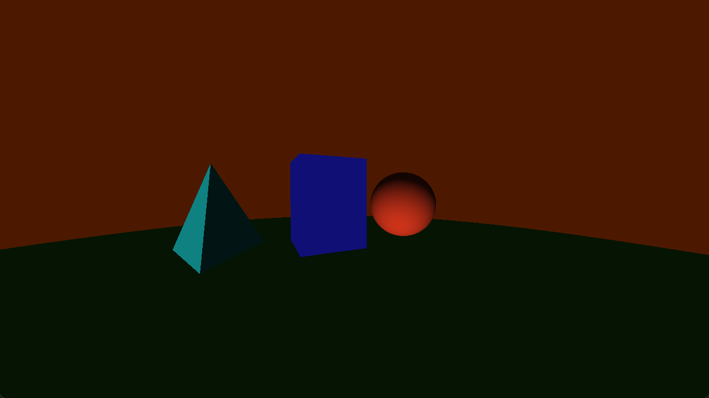

current progress


## Prerequisites

To build this project, you will need:
* A C++17 (or newer) compatible compiler (GCC/MinGW, MSVC, or Clang)
* [CMake](https://cmake.org/download/) (v3.15+)
* [Vulkan SDK](https://vulkan.lunarg.com/) (Required for `glslc` compiler and Vulkan headers)
* GLFW (Automatically fetched and built via CMake)

## Build Instructions

```bash
# 1. Clone the repository
git clone [https://github.com/yourusername/Metropolis.git](https://github.com/yourusername/Metropolis.git)
cd Metropolis

# 2. Create a build directory
mkdir build
cd build

# 3. Generate CMake cache and build
cmake ..
cmake --build .
```
## References

* https://nsgg.tistory.com/367 - drawing triangles
* https://www.youtube.com/watch?v=fK1RPmF_zjQ - Moller Trumbore Algorithm
* https://vkguide.dev - vulkan guide
* https://marioslab.io/posts/jitterbugs/ - sub pixel jittering ie anti aliasing